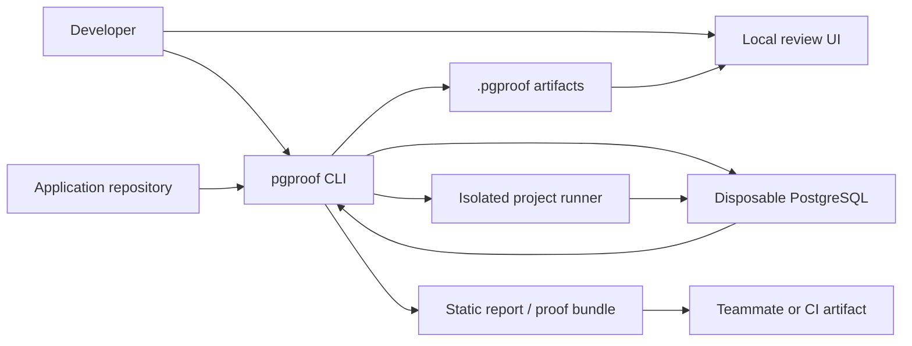
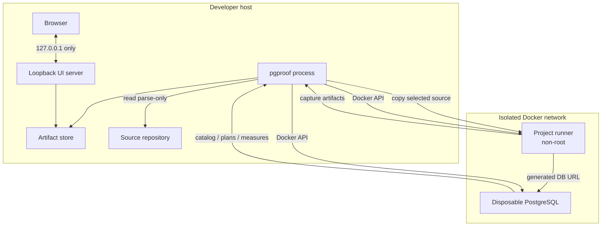
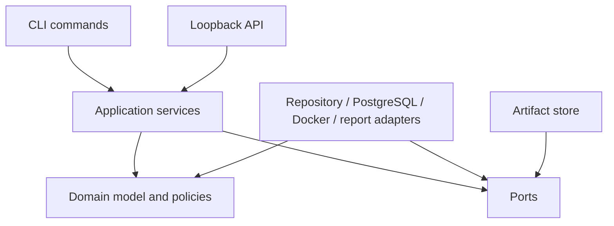
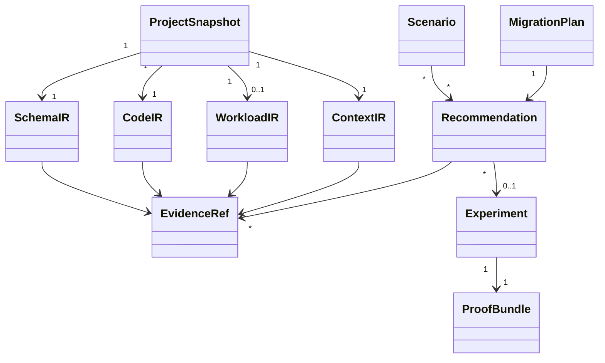
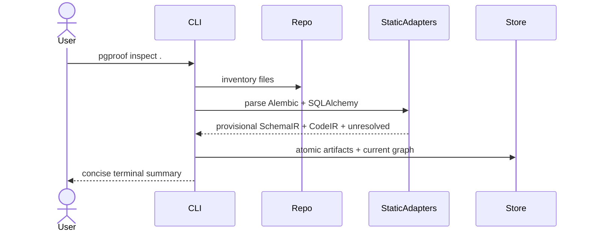
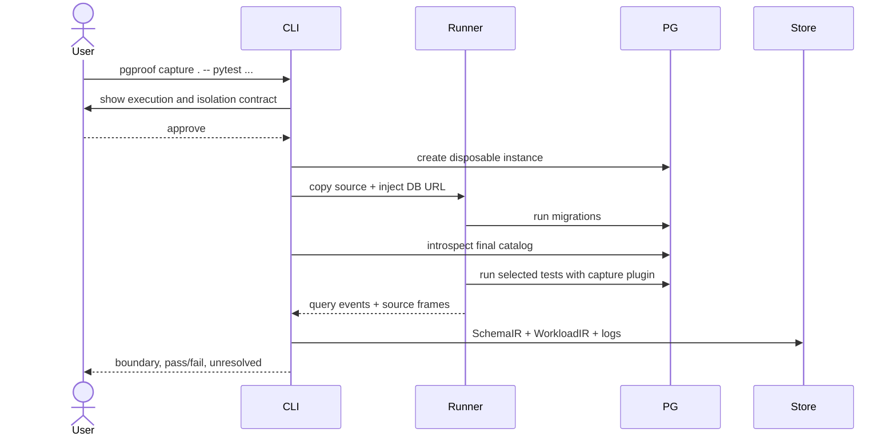
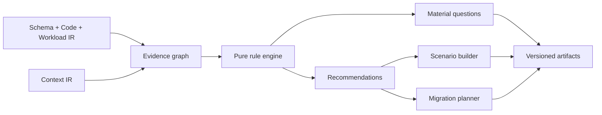
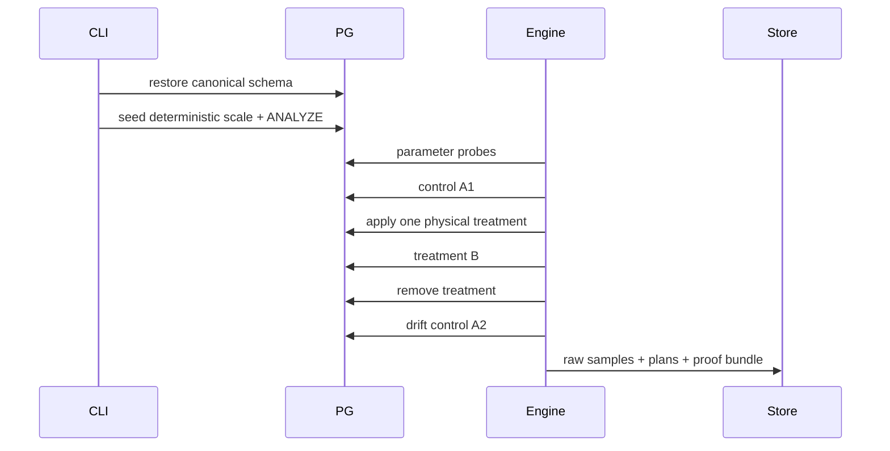
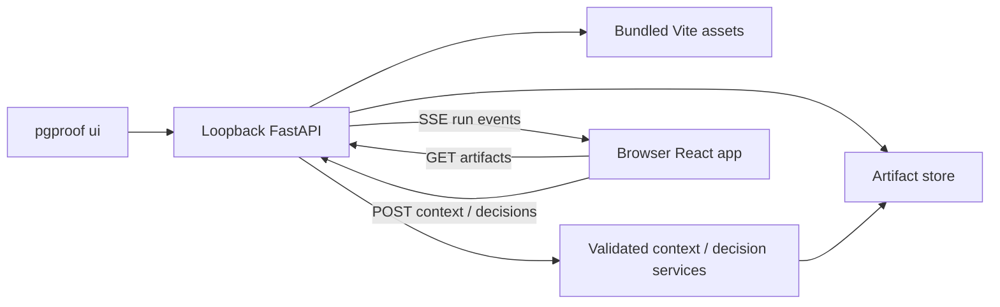

# pgproof architecture

**Status:** accepted implementation baseline  
**Purpose:** define component ownership, dependency rules, runtime boundaries, and data flow

## 1. Architectural goals

pgproof MUST be:

- trustworthy when analysis is partial;
- useful before project code is executed;
- local-first and inspectable;
- deterministic where inputs permit;
- resumable across expensive stages;
- framework-adaptable without polluting the core;
- explicit about safety boundaries;
- able to evolve backend and frontend independently through versioned artifacts; and
- distributable as one CLI installation with bundled local UI assets.

## 2. System context



No hosted pgproof control plane exists in v1. The browser talks only to a loopback process started by the CLI.

## 3. Runtime processes and trust boundaries



### Host CLI

Trusted orchestration authority. It reads the repository, validates configuration, controls containers, writes artifacts atomically, runs deterministic analysis, and starts the optional loopback server.

### Project runner

Untrusted user-code boundary. It executes only visible, user-approved migration/test commands. It receives a repository copy, generated database credentials, allowlisted environment, no host write mount, no external network, and explicit resource/time limits.

### Disposable PostgreSQL

Tool-owned database. It never receives production credentials or data in v1. One experiment owns its database state; scales and candidates run sequentially.

### Local UI

Untrusted presentation client. It does not parse repositories or run experiments. It reads versioned artifacts through a loopback API and may request context/decision-log mutations through narrow validated endpoints.

## 4. Layered component model



### Dependency rule

- `domain` imports no CLI, web, Docker, PostgreSQL driver, SQLAlchemy, Alembic, or UI package.
- `application` depends on domain models and abstract ports.
- `adapters` implement ports and may depend on external libraries.
- `cli` and `local_api` are composition roots.
- the UI depends only on generated TypeScript contract types and HTTP/artifact clients.
- rules consume IR and emit findings/recommendations; they do not perform I/O.

## 5. Repository structure

```text
pgproof/
  pyproject.toml
  uv.lock
  README.md
  docs/
  contracts/
    schemas/                 generated JSON Schemas
    fixtures/                frozen cross-language examples
  src/pgproof/
    cli/
      app.py
      commands/
      rendering/
    domain/
      ir/
      evidence/
      recommendations/
      scenarios/
      experiments/
    application/
      inspect.py
      configure.py
      capture.py
      review.py
      verify.py
      reproduce.py
      report.py
    ports/
      artifacts.py
      repository.py
      database.py
      runner.py
      clock.py
    store/
      paths.py
      atomic.py
      artifacts.py
      manifest.py
      run.py
    adapters/
      repository/
        inventory.py
        alembic_static.py
        sqlalchemy_static.py
      postgres/
        catalog.py
        explain.py
        benchmark.py
      runner/
        docker.py
        pytest_plugin.py
      sql/
        parser.py
        fingerprint.py
      reports/
        markdown.py
        static_bundle.py
      diagrams/
        graph_ir.py
        mermaid.py
        dbml.py
    rules/
      schema/
      workload/
      tenancy/
      procedures/
      topology/
      migrations/
    seed/
    local_api/
    ui_dist/                 built UI copied during packaging
  ui/
    src/
      app/
      components/
      features/
      contract/
      styles/
    tests/
  tests/
    unit/
    contract/
    integration/
    e2e/
  fixtures/
    demo-broken/
    demo-clean/
    schemas/
    captures/
    plans/
    proofs/
  scripts/
```

## 6. Canonical domain model



### Stable identities

- table: schema-qualified logical name;
- column: table identity plus column name;
- source: repository-relative path, line, and content hash;
- migration: Alembic revision id;
- query: normalized parse-tree fingerprint plus resolved relations and parameter types;
- operation: adapter kind plus stable operation/test identity;
- recommendation: rule id plus canonical affected-object ids;
- experiment/proof: recommendation id plus input-manifest hash.

Database OIDs, absolute paths, transient container ids, and wall-clock time MUST NOT define stable identity.

## 7. Artifact architecture

Artifacts are the durable boundary between stages and between backend and frontend.

```text
.pgproof/
  project.json
  context.json
  decisions.json
  analysis/
    schema.json
    code.json
    workload.json
    evidence.json
    recommendations.json
    scenarios.json
    migration-plan.json
  diagrams/
    current.graph.json
    target.graph.json
  runs/<run-id>/
    manifest.json
    events.ndjson
    result.json
  proofs/<recommendation-id>/
  report/
```

### Artifact rules

- Every document contains `schema_version`, `tool_version`, `created_at`, and input hashes.
- Pydantic domain transport models generate JSON Schema 2020-12.
- Generated schemas produce frontend TypeScript types.
- Contract fixtures validate in both Python and TypeScript tests.
- Writes use temp file + fsync where appropriate + atomic rename.
- A manifest is written last; its presence marks a complete stage.
- Private parameters are stored outside shareable artifacts with restrictive permissions.
- Readers reject unsupported major versions and tolerate additive compatible fields.

### Stage cache

Each stage key hashes:

- normalized stage configuration;
- upstream artifact hashes;
- relevant repository file hashes;
- adapter/parser/generator version; and
- PostgreSQL/container identity when applicable.

Changing context answers invalidates recommendation/scenario/migration outputs but does not invalidate repository parsing. Changing seed invalidates dataset and verification but not schema analysis.

## 8. Primary data flows

### 8.1 Parse-only inspection



No imports or subprocess execution occur.

### 8.2 Migration and test capture



Migration failure aborts final-catalog analysis. Test failure does not erase successfully captured operations, but makes workload completeness explicit.

### 8.3 Review



The rule engine is deterministic for identical versioned inputs.

### 8.4 Verification



Candidates and scales are sequential. One intervention changes at a time.

## 9. Local UI architecture



### API boundary

Allowed:

- list project/run/artifact metadata;
- return validated public artifacts;
- stream `events.ndjson` as server-sent events;
- validate and update context answers;
- validate and update decision-log entries;
- request a CLI command only through an explicit browser confirmation followed by CLI-owned execution.

Forbidden:

- arbitrary file access;
- arbitrary command execution;
- accepting a database URL;
- returning private bind values;
- binding beyond loopback;
- silent background analysis.

The server uses an unguessable session token delivered in the opened URL and an origin check. It terminates with the CLI process unless `--keep-open` is explicitly used.

## 10. Frontend architecture

The UI is a React + TypeScript single-page application built with Vite. Interactive graphs use React Flow over canonical graph artifacts. The UI owns layout and presentation state only.

Feature boundaries:

```text
ui/src/features/
  overview/
  design-graph/
  operations/
  questions/
  recommendations/
  scenarios/
  experiments/
  migration-path/
  trust/
```

Each feature receives typed contract data through a repository client. Components MUST render explicit empty, partial, incompatible, loading, and failed states.

Diagram node placement is presentation state and MAY persist locally. It never alters the canonical relationship graph.

## 11. Runner architecture

### Image strategy

v1 supports:

1. user-supplied project runner image; or
2. a project Dockerfile selected during configuration.

Dependency installation/build is a separate visible step. Runtime migration/test capture uses a network-disabled isolated network containing only the project runner and disposable PostgreSQL.

### Runner filesystem

- source copied into an ephemeral writable layer;
- no home-directory mount;
- no Docker socket inside the runner;
- writable `/tmp` with size limit;
- output capture directory mounted to a tool-owned temporary directory;
- non-root uid/gid;
- read-only root filesystem where compatible.

## 12. Extension architecture

Adapters implement narrow ports:

- repository inventory;
- migration discovery;
- ORM model/relationship extraction;
- runtime query capture;
- SQL parsing/fingerprinting;
- catalog introspection;
- diagram export.

v1 does not expose a third-party plugin API. Internal adapter boundaries exist to keep later ecosystems possible without prematurely freezing public extension contracts.

## 13. Rule architecture

A rule declares:

```python
class Rule(Protocol):
    id: RuleId
    version: int
    required_inputs: frozenset[InputKind]

    def evaluate(self, snapshot: AnalysisSnapshot) -> RuleResult: ...
```

`RuleResult` may contain observations, material questions, recommendation candidates, unsupported reasons, and experiment hypotheses.

Rules MUST NOT:

- read files or databases;
- mutate IR;
- hide required missing inputs;
- produce measured claims;
- assign universal numerical health scores.

## 14. State and failure model

Each stage is one of:

```text
pending → running → complete
                 ↘ partial
                 ↘ failed
                 ↘ cancelled
```

- `complete` means artifact contract satisfied.
- `partial` means output remains useful and its boundary is explicit.
- `failed` means no downstream consumer may treat the stage as valid.
- `cancelled` preserves completed upstream artifacts and terminates containers.

Schema reconstruction cannot be partial after a migration failure. Workload capture can be partial when selected tests fail because individual completed operations remain attributable.

## 15. Packaging and distribution

- Python wheel exposes the `pgproof` entry point.
- Release builds compile the UI and copy hashed assets into `src/pgproof/ui_dist`.
- The wheel includes JSON Schemas, default rule metadata, and report templates.
- Container images and extensions are pinned by digest in released defaults.
- Reproduction manifests require compatible tool and generator versions.
- Development uses one repository and separate Python/Node lockfiles.

## 16. Architectural decision boundaries

The following require ADRs before implementation diverges:

- adding a hosted service or telemetry;
- accepting external/production database URLs;
- executing project code outside the runner;
- changing the evidence labels;
- letting the UI execute arbitrary commands;
- adding automatic repository mutation;
- changing artifact compatibility rules;
- exposing a third-party plugin API;
- making an LLM part of evidence or recommendation generation.

## 17. Architecture acceptance criteria

- Parse-only tests prove no application imports/subprocesses occur.
- Domain/rule packages pass dependency-boundary tests.
- Python and TypeScript validate the same frozen artifact fixtures.
- The UI works from fixtures without Python analysis code.
- Loopback API rejects non-loopback bind and invalid session/origin.
- Runner integration tests show no host source mutation and no external network.
- Stage interruption leaves either the previous complete artifact or no manifest, never a half-valid artifact.
- Verification cleanup removes every owned container, network, and temporary credential.
