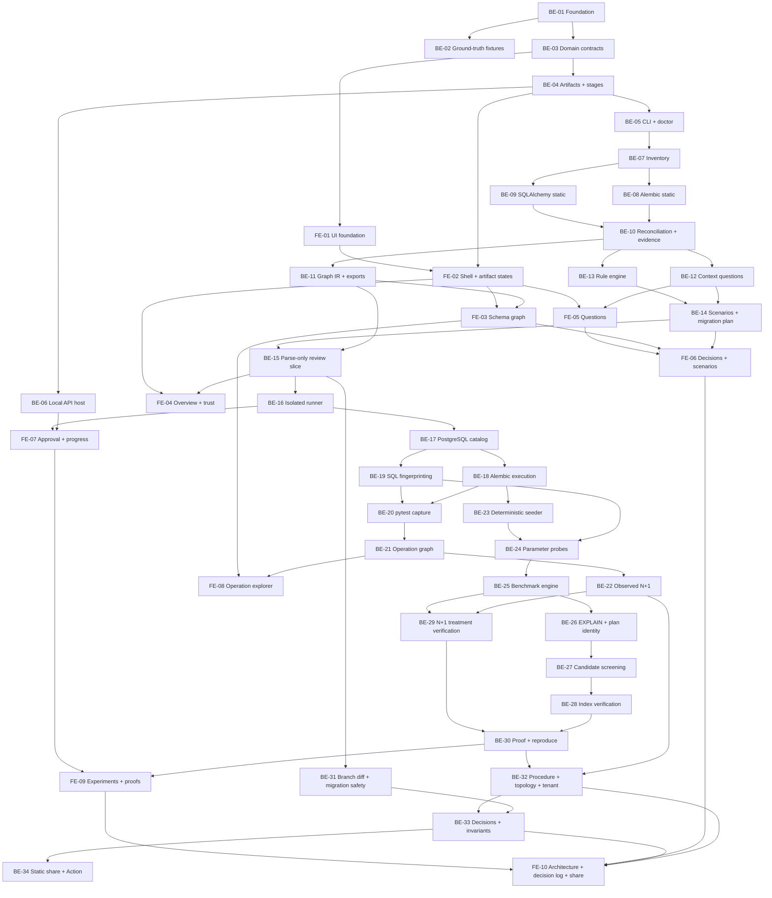

# pgproof implementation PR roadmap

**Status:** accepted pre-coding baseline  
**Purpose:** keep implementation reviewable, dependency-ordered, and vertically testable

## 1. Naming and branch convention

Backend PR:

```text
PR title: [BE-07] Repository inventory
Branch:   be/07-repository-inventory
```

Frontend PR:

```text
PR title: [FE-03] Interactive schema graph
Branch:   fe/03-interactive-schema-graph
```

Rules:

- IDs never change after work begins.
- A PR branches from the merge commit containing all declared dependencies.
- PRs may be developed concurrently only when the dependency graph permits it.
- Contract fixtures land in the backend dependency before frontend implementation begins.
- One PR owns one coherent contract or user-visible slice.
- Refactors needed only by a feature belong in that feature PR unless they are independently reviewable.
- No catch-all “polish,” “cleanup,” or “integration” PR at the end.

## 2. Definition of done for every PR

- Scope and non-scope match this roadmap or an approved ADR.
- Unit/contract/integration tests appropriate to risk pass.
- Complete, partial, empty, failed, and incompatible states are handled where applicable.
- CLI output is deliberately designed and snapshot-tested for backend features.
- UI output is accessible and visually regression-tested for frontend features.
- Privacy/security impact is stated.
- Artifact compatibility impact is stated.
- User-facing and contributor documentation is updated.
- No hidden application-code execution, network access, or repository mutation is introduced.
- Acceptance evidence is attached to the PR description.

## 3. Program dependency map



## 4. Milestones

| Milestone | Outcome | PRs |
|---|---|---|
| M0 Foundation | Contracts, artifacts, polished CLI/UI shells | BE-01–06, FE-01–02 |
| M1 Trustworthy design core | Parse-only ERD, questions, decisions, scenarios, review | BE-07–15, FE-03–06 |
| M2 Code execution and workload | Safe migration/test capture and operation/N+1 map | BE-16–22, FE-07–08 |
| M3 Experimental proof | Data, benchmark, index/N+1 verification, reproduction | BE-23–30, FE-09 |
| M4 Architecture and adoption | Migration safety, topology/procedures, decisions, sharing | BE-31–34, FE-10 |

M1 must be valuable to an external developer before M2 begins. M3 must reproduce on two machines before M4 expands architecture advice.

---

# Backend PRs

## M0 — foundation

### BE-01 — Repository and quality foundation

**Branch:** `be/01-repository-foundation`  
**Depends on:** none

Deliver:

- Python package/CLI entry point skeleton;
- dependency and tool pinning;
- lint, type, unit, coverage, and packaging CI;
- repository layout and dependency-boundary checks;
- macOS arm64 and Linux amd64 test jobs;
- contributor commands and ADR template.

Accept when a wheel installs, `pgproof --help` runs, and empty test/quality pipelines pass. No product command implementation.

### BE-02 — Ground-truth fixtures and oracle

**Branch:** `be/02-ground-truth-fixtures`  
**Depends on:** BE-01

Deliver:

- broken and clean SQLAlchemy/Alembic fixture repositories;
- two index cases, one observed N+1, one tenant case;
- `EXPECTED.yaml` evidence-category oracle;
- hand-measured baseline/proof notes;
- clean-control assertions;
- pinned external benchmark commit record.

Accept when a human can reproduce expected cases manually and no expected tenant result contains fabricated performance numbers.

### BE-03 — Domain IR and JSON contracts

**Branch:** `be/03-domain-contracts`  
**Depends on:** BE-01

Deliver:

- core identifiers and transport envelopes;
- `SchemaIR`, `CodeIR`, `WorkloadIR`, `ContextIR`, evidence, recommendation, scenario, graph, stage, and proof summary models;
- Pydantic-generated JSON Schemas;
- frozen JSON fixtures and compatibility tests;
- schema-version policy and TypeScript generation hook.

Accept when Python round trips every fixture and a generated TypeScript compile smoke test passes.

### BE-04 — Artifact store, run manifests, and stage events

**Branch:** `be/04-artifacts-and-stages`  
**Depends on:** BE-03

Deliver:

- `.pgproof` directory layout;
- atomic artifact writer/reader;
- hash manifest and compatibility validation;
- run/stage state machine and NDJSON events;
- cache-key abstraction;
- cancellation-safe incomplete-write behavior.

Accept when crash injection never leaves a half-valid artifact and incompatible major versions fail clearly.

### BE-05 — CLI shell, rendering primitives, and `doctor`

**Branch:** `be/05-cli-and-doctor`  
**Depends on:** BE-04

Deliver:

- Click command tree and global options;
- exit-code contract;
- TTY/color/Unicode/ASCII capability detection;
- semantic terminal rendering primitives;
- `doctor` repository/environment capability report;
- snapshot matrix at 80/120 columns and JSON-mode separation.

Accept when output matches `INTERFACE_DESIGN.md` and non-TTY logs contain no animation/control codes.

### BE-06 — Loopback API and bundled UI host

**Branch:** `be/06-local-api-host`  
**Depends on:** BE-04

Deliver:

- `pgproof ui` server lifecycle;
- loopback-only binding, session token, origin checks, and security headers;
- public-artifact read endpoints;
- validated context/decision write stubs;
- run-event SSE endpoint;
- bundled static asset serving and shutdown behavior.

Accept when remote bind/origin/private artifact access is rejected and a placeholder bundled UI opens locally.

## M1 — trustworthy design core

### BE-07 — Bounded repository inventory

**Branch:** `be/07-repository-inventory`  
**Depends on:** BE-05

Deliver file discovery, ignore/symlink/size safety, framework/migration/test/Docker detection, content hashing, source references, and `inspect` inventory output.

Accept when no path outside the selected root is read through symlinks and skipped files are reported.

### BE-08 — Static Alembic revision graph and operations

**Branch:** `be/08-alembic-static-analysis`  
**Depends on:** BE-07, BE-02

Deliver AST-only revision metadata/graph, common operation parsing, unresolved operation model, multiple-head/cycle/missing-revision detection, and provisional schema facts.

Accept on golden fixtures including branches, merge revisions, helpers, raw SQL, DML, and dynamic unsupported code. No migration imports.

### BE-09 — Static SQLAlchemy/SQLModel model analysis

**Branch:** `be/09-sqlalchemy-static-analysis`  
**Depends on:** BE-07, BE-02

Deliver AST-only model, column, type, constraint, relationship, cascade, loading-strategy, and source extraction with unresolved constructs.

Accept on sync/async declarative and SQLModel fixtures without importing application modules.

### BE-10 — Schema/model reconciliation and evidence graph

**Branch:** `be/10-reconciliation-and-evidence`  
**Depends on:** BE-08, BE-09, BE-03

Deliver canonical matching, physical/provisional/ORM distinction, disagreement observations, immutable evidence refs, source staleness detection, and evidence traversal.

Accept when physical and ORM-only edges cannot be serialized as the same relation kind.

### BE-11 — Canonical graph IR and exports

**Branch:** `be/11-graph-ir-and-exports`  
**Depends on:** BE-10

Deliver current/target Graph IR, ER view projection, overlay contracts, Mermaid/DBML export, deterministic graph identity, and textual fallback.

Accept when composite/self/many-to-many/ORM-only fixture graphs match the oracle and exports preserve evidence distinctions.

### BE-12 — Context configuration and material questions

**Branch:** `be/12-context-and-questions`  
**Depends on:** BE-10, BE-05

Deliver `pgproof configure`, seven core question schemas, dynamic skipping, unknown answers, affected-decision links, TOML round trip, and non-interactive validation.

Accept when the demo asks six or fewer questions and changing an answer invalidates only dependent stages.

### BE-13 — Deterministic rule engine and Ring A rules

**Branch:** `be/13-rule-engine`  
**Depends on:** BE-10, BE-12

Deliver pure rule protocol/result, versioned rule registry, initial relational/tenant/index-candidate rules, question emission, unsupported reasons, and golden snapshots.

Accept when clean fixture has no headline result and every recommendation has traceable evidence/assumptions.

### BE-14 — Scenario builder and migration-plan core

**Branch:** `be/14-scenarios-and-migration-plan`  
**Depends on:** BE-12, BE-13, BE-11

Deliver launch/growth/availability projections, scenario diff causes, change/plan-step model, dependency sorting, cycle detection, and initial staged migration templates.

Accept when context changes deterministically add/remove affected decisions and the migration plan is topologically valid.

### BE-15 — Parse-only review vertical slice

**Branch:** `be/15-parse-only-review`  
**Depends on:** BE-11, BE-14, BE-02

Deliver `inspect`, `configure`, and `review` end-to-end; concise CLI summary; Markdown/JSON outputs; current/target diagrams; unresolved boundary; artifact caching.

Accept when an external developer can run the no-Docker flow on broken, clean, and pinned benchmark fixtures within performance budgets.

## M2 — isolated execution and workload

### BE-16 — Isolated Docker runner and approval manifest

**Branch:** `be/16-isolated-runner`  
**Depends on:** BE-15

Deliver runner image/build selection, source copy, non-root/resource/PID/time limits, allowlisted environment, network-disabled runtime, approval manifest, cancellation, cleanup, and orphan detection.

Accept with adversarial tests for network, host mutation, environment leakage, timeout, SIGINT, and orphan cleanup.

### BE-17 — PostgreSQL lifecycle and catalog adapter

**Branch:** `be/17-postgres-catalog`  
**Depends on:** BE-16, BE-03

Deliver pinned Postgres lifecycle, generated credentials, extension metadata, complete supported catalog introspection, canonical schema SQL, and version/settings capture.

Accept when supported catalog objects round-trip into a fresh database and match Graph IR expectations.

### BE-18 — Alembic execution and physical reconciliation

**Branch:** `be/18-alembic-execution`  
**Depends on:** BE-17, BE-08, BE-10

Deliver migration command execution, head validation, physical-schema snapshot, static/ORM/catalog reconciliation, DML preservation metadata, and failure logs.

Accept when failed migrations produce no physical-analysis manifest and successful complex fixtures reconcile correctly.

### BE-19 — PostgreSQL SQL parser and fingerprinting

**Branch:** `be/19-sql-fingerprinting`  
**Depends on:** BE-17, BE-03

Deliver DBAPI placeholder canonicalization, PostgreSQL parse-tree normalization, relation resolution, parameter-type identity, fingerprinting, statement classification, and unsupported output.

Accept on a corpus of real PostgreSQL/SQLAlchemy statements with idempotence and semantic-distinction tests.

### BE-20 — pytest SQLAlchemy capture plugin

**Branch:** `be/20-pytest-capture`  
**Depends on:** BE-18, BE-19, BE-16

Deliver cursor event listener, bind-safe serializer, stack filtering, pytest phase/node correlation, transaction/session correlation, NDJSON survival, sync/async engines, and `capture` command.

Accept when listener does not change results, private canaries never enter public artifacts, and failed tests preserve bounded capture.

### BE-21 — Workload IR and operation/transaction graph

**Branch:** `be/21-operation-graph`  
**Depends on:** BE-20, BE-11

Deliver event classification, query grouping, operation boundaries, transaction sequence, read/write table edges, call-site aggregation, setup/teardown filters, and coverage-boundary metrics.

Accept when the UI fixture can trace operation → transaction → query → table with source evidence.

### BE-22 — Observed N+1 and amplification analysis

**Branch:** `be/22-observed-n-plus-one`  
**Depends on:** BE-21, BE-13

Deliver repeated-query, possible-amplification, observed-N+1 classifications; parent/child bind correlation; relationship/source evidence; loading-strategy candidates; clean controls.

Accept when demo N+1 is observed, ordinary repetition is not mislabeled, and test counts are never presented as production frequency.

## M3 — experimental proof

### BE-23 — Deterministic FK-correct data generator

**Branch:** `be/23-deterministic-seeder`  
**Depends on:** BE-18, BE-02

Deliver seed/epoch/component streams, dependency order, uniqueness/check/FK/enum/boolean/time distributions, cycle handling, migration-row awareness, sequence sync, COPY loading, assumptions, and `ANALYZE`.

Accept through property tests for integrity, repeatability, unrelated-stream stability, and explicit unsupported constraints.

### BE-24 — Distribution-aware parameter probes

**Branch:** `be/24-parameter-probes`  
**Depends on:** BE-23, BE-19

Deliver predicate extraction, realized selectivity probes, most-common/time-range variants, captured-bind policy, parameter descriptors/redaction, and generic/custom-plan test inputs.

Accept when every probe references real generated values and reports realized—not guessed—selectivity.

### BE-25 — Raw benchmark and A1/B/A2 experiment engine

**Branch:** `be/25-benchmark-engine`  
**Depends on:** BE-24, BE-17, BE-04

Deliver resource/settings manifest, sequential scales, fetch policies, warmups/samples, median/IQR, variance gate, timeouts, A1/B/A2 lifecycle, drift verdict, cancellation, and raw evidence artifacts.

Accept when intentionally noisy fixtures are inconclusive and stable fixtures reproduce direction across repeated runs.

### BE-26 — EXPLAIN parser, diagnostics, and plan fingerprint

**Branch:** `be/26-explain-and-plan-fingerprint`  
**Depends on:** BE-25

Deliver separate `TIMING OFF` JSON EXPLAIN collection, recursive plan IR, buffers/WAL diagnostics, P1–P6 inputs, normalized plan shape, SHA-256 identity, and plan fixtures for PG16–18.

Accept when timing/cost/row changes do not alter plan identity but join/scan/relation changes do.

### BE-27 — Index candidate generation and HypoPG screening

**Branch:** `be/27-index-candidates`  
**Depends on:** BE-26, BE-13

Deliver structural index comparison, single/composite generation, five-candidate budget, equality/range/order logic, HypoPG optional screening, discard reasons, and candidate artifacts.

Accept when screening is never labeled measured/verified and existing compatible indexes prevent duplicates.

### BE-28 — Physical index verification and write-cost guard

**Branch:** `be/28-index-verification`  
**Depends on:** BE-27, BE-25, BE-23

Deliver physical create/drop treatments, read thresholds, plan-use evidence, inserts, indexed/unrelated updates, WAL, build time, size, HOT-impact observation, and trade-off verdict model.

Accept when demo finds both expected indexes, rejects a marginal candidate, and emits no universal `KEEP` without workload policy.

### BE-29 — N+1 treatment and equivalence verification

**Branch:** `be/29-n-plus-one-verification`  
**Depends on:** BE-22, BE-25

Deliver user/tool treatment runner, query-count and wall-time comparison, declared equivalence assertions, supported eager-loading/set-query paths, and unsupported semantics.

Accept when demo treatment preserves declared results and reduces amplification while a deliberately wrong treatment is rejected.

### BE-30 — Portable proof bundle and reproduction

**Branch:** `be/30-proof-and-reproduce`  
**Depends on:** BE-28, BE-29, BE-26

Deliver complete bundle, input/evidence hashes, schema/query/data/config snapshots, README, compatibility validator, `reproduce`, qualitative tolerance, and private-bind exclusion.

Accept when index proof reproduces without source repository on macOS arm64 and Linux amd64 and tampering is detected.

## M4 — architecture, evolution, and adoption

### BE-31 — Branch diff and migration-safety planner

**Branch:** `be/31-migration-safety`  
**Depends on:** BE-15, BE-18

Deliver base/current schema comparison, destructive/constraint/type/index risks, version-sensitive lock/rewrite facts, expand-contract templates, reversibility, and ordered deployment boundaries.

Accept on safe/unsafe migration corpus without invented production duration.

### BE-32 — Stored-procedure, topology, and tenant assessment

**Branch:** `be/32-architecture-assessment`  
**Depends on:** BE-22, BE-30, BE-12, BE-13

Deliver procedure candidacy, primary-only/HA/read-replica decision trees, operation routing matrix, tenant-enforcement analysis, alternatives/trade-offs, blockers, and architecture graph overlays.

Accept when code alone never asserts replica necessity and immediate-consistency operations remain primary-required.

### BE-33 — Decision log, invariants, and proposed tests

**Branch:** `be/33-decisions-and-invariants`  
**Depends on:** BE-31, BE-32, BE-06

Deliver accept/reject/defer/revisit model, evidence-change reactivation, invariant schema, proposed catalog/Alembic/query-count/raiseload/equivalence tests, and validated local API mutations.

Accept when deferred recommendations remain quiet until evidence/revisit condition changes and generated tests are never silently written to source.

### BE-34 — Privacy-safe static report and GitHub Action

**Branch:** `be/34-static-report-and-action`  
**Depends on:** BE-33, BE-30, BE-15

Deliver self-contained static report, share inventory/redaction, absolute-path normalization, PR-diff summary, compact GitHub Action, artifact upload, and no-account configuration.

Accept with seeded secret canaries absent, changed-decision-only PR comment, and full evidence available in the artifact.

---

# Frontend PRs

## M0 — frontend foundation

### FE-01 — UI foundation and visual test harness

**Branch:** `fe/01-interface-foundation`  
**Depends on:** BE-03

Deliver React/TypeScript/Vite setup, generated contract types, semantic light/dark tokens, typography/density, accessible primitives, lint/unit/visual CI, responsive harness, and fixture gallery.

Accept when `INTERFACE_DESIGN.md` token/accessibility rules pass at 1440/1024/390 px in both themes. No product dashboard yet.

### FE-02 — App shell and artifact-state system

**Branch:** `fe/02-app-shell-and-states`  
**Depends on:** FE-01, BE-04, BE-06

Deliver local API client, project/scenario/run context, navigation shell, complete/partial/failed/stale/incompatible/empty states, route error boundaries, and artifact fixture switching.

Accept when every artifact state is visibly distinct and keyboard-accessible without inventing data.

## M1 — design-review experience

### FE-03 — Interactive current/target schema graph

**Branch:** `fe/03-interactive-schema-graph`  
**Depends on:** FE-02, BE-11

Deliver React Flow graph, physical/ORM/proposed encodings, overlays, search/focus, inspector, layout persistence, responsive focused mode, keyboard access, and semantic table fallback.

Accept on small/composite/self-reference/large-schema fixtures; users distinguish physical and ORM-only edges without relying on color.

### FE-04 — Overview, analysis boundary, and trust view

**Branch:** `fe/04-overview-and-trust`  
**Depends on:** FE-02, BE-15

Deliver three-decision overview, quiet metrics, mode/boundary, unresolved inputs, execution history, artifacts, redactions, next action, and current-design fragment.

Accept when no health score/card clutter is introduced and CLI/UI counts match the same fixture.

### FE-05 — Material-question workflow

**Branch:** `fe/05-design-questions`  
**Depends on:** FE-02, BE-12, BE-06

Deliver question forms, unknown answers, why-it-matters, affected decisions, validation, local save, and answer-change diff preview.

Accept when a keyboard-only user changes one answer and can identify resulting scenario changes.

### FE-06 — Decisions, alternatives, scenarios, and migration path

**Branch:** `fe/06-decisions-and-scenarios`  
**Depends on:** FE-03, FE-05, BE-14

Deliver dependency-sorted decision list/detail, evidence/source/assumption/trade-off views, patch sketches, scenario comparison, target graph, and initial migration-plan list/graph.

Accept when each decision traces to evidence in one action and scenario differences cite the changing context.

## M2 — execution and workload

### FE-07 — Execution approval and live stage progress

**Branch:** `fe/07-approval-and-progress`  
**Depends on:** FE-02, BE-06, BE-16

Deliver factual approval dialog, exact command/isolation/resources/environment summary, confirmation nonce flow, SSE stage timeline, cancellation, reconnect/resume, failure recovery, and no-animation/reduced-motion state.

Accept when UI cannot submit arbitrary command data and a failed run leaves prior artifacts usable.

### FE-08 — Operation, transaction, and N+1 explorer

**Branch:** `fe/08-operation-explorer`  
**Depends on:** FE-03, BE-21, BE-22

Deliver operation list, transaction/query sequence, table read/write map, repeated/N+1 states, bind-safe evidence, source stacks, setup/teardown controls, routing placeholder, and textual fallback.

Accept when test boundaries are unmistakable and ordinary repeated queries are visually distinct from observed N+1.

## M3 — proof experience

### FE-09 — Experiments, plan comparison, and proof detail

**Branch:** `fe/09-experiments-and-proofs`  
**Depends on:** FE-07, BE-30

Deliver candidate statuses, parameter/fixture context, A1/B/A2 distributions, plan-shape comparison, read/write/WAL/storage trade-offs, rejected/inconclusive states, raw evidence, and reproduction action.

Accept when exact medians/IQRs remain legible, no seven-sample p95 appears, and a user can reproduce from the detail view.

## M4 — architecture and sharing

### FE-10 — Architecture scenarios, decision log, and share workflow

**Branch:** `fe/10-architecture-and-sharing`  
**Depends on:** FE-06, FE-09, BE-32, BE-33, BE-34

Deliver procedure/primary-replica alternatives, routing matrix, tenancy overlay, accept/reject/defer/revisit controls, invariant/test proposals, mature migration graph, share inventory, and static-report preview.

Accept when no advisory topology appears verified, private canaries are absent from preview, and the complete external design-partner journey succeeds.

---

## 5. Merge order

Default serial order:

```text
BE-01 → BE-02 → BE-03 → BE-04 → BE-05 → BE-06
      → FE-01 → FE-02
      → BE-07 → BE-08 + BE-09 → BE-10 → BE-11 + BE-12 + BE-13
      → BE-14 → BE-15 → FE-03 + FE-04 + FE-05 → FE-06
      → BE-16 → BE-17 → BE-18 + BE-19 → BE-20 → BE-21 → BE-22
      → FE-07 + FE-08
      → BE-23 → BE-24 → BE-25 → BE-26 → BE-27 → BE-28
      → BE-29 → BE-30 → FE-09
      → BE-31 → BE-32 → BE-33 → BE-34 → FE-10
```

`+` denotes safe concurrency after shared dependencies merge.

## 6. Milestone release gates

### M0 gate

- installable wheel and built UI shell;
- Python/TypeScript contract fixtures agree;
- CLI and UI visual harnesses approved;
- artifact crash safety and loopback security pass.

### M1 gate — first external design-partner build

- no-Docker inspect/configure/review works;
- trustworthy provisional ERD;
- short material interview;
- traceable decisions/scenarios/migration plan;
- clean fixture no headline findings;
- one external developer completes the flow unaided.

### M2 gate

- isolated migrations and selected tests run on both target platforms;
- no network/host mutation/secret leakage;
- physical catalog reconciles;
- demo N+1 observed, clean control clean;
- partial test failure remains honest and useful.

### M3 gate — proof claim allowed

- deterministic target dataset;
- stable A1/B/A2 experiments;
- two index cases and one N+1 treatment verified;
- marginal/bad candidates rejected;
- proof reproduces on macOS arm64 and Linux amd64 without source repository for index cases.

### M4 gate — v1 release candidate

- architecture advice remains context-dependent and advisory;
- branch/migration plan is version-sensitive and non-predictive;
- local decisions/invariants work;
- share inventory passes secret canaries;
- one real PR artifact is shared and changes a design decision.

## 7. Scope-control rules

Park a request unless it is required by the current milestone gate. Particularly:

- no hosted service/account/telemetry;
- no production connection;
- no automatic source mutation;
- no new ORM/database;
- no concurrency/lock lab before proof reproduction;
- no baseline CI policy beyond the minimal PR-diff Action;
- no LLM-generated evidence or recommendation;
- no generic plugin API.

If a PR needs more than one new public artifact type and one user-visible capability, split it unless atomicity is demonstrated in the PR plan.

## 8. PR preparation checklist

Before opening any numbered PR:

1. Copy `.github/PULL_REQUEST_TEMPLATE.md` content.
2. Link the roadmap section and relevant acceptance criteria.
3. Confirm every declared dependency is merged.
4. List contract/artifact changes.
5. Add or update frozen fixtures first.
6. State safety/privacy behavior.
7. Include CLI/UI screenshots or snapshots when presentation changes.
8. Include exact verification commands and results.
9. State what remains intentionally unsupported.
